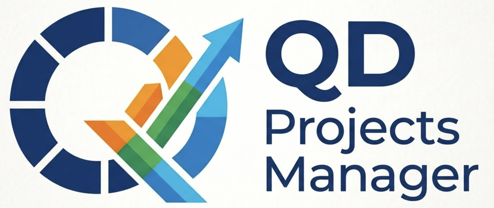
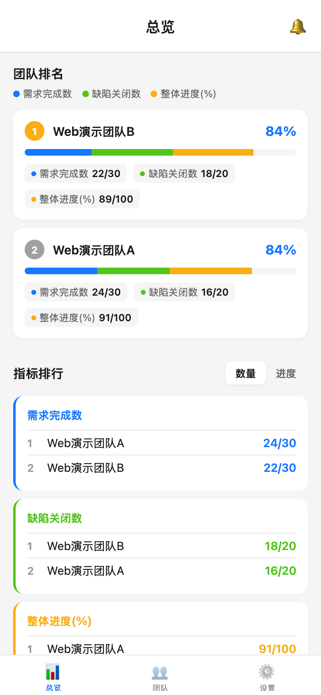
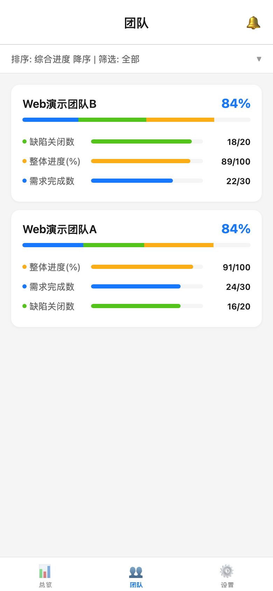
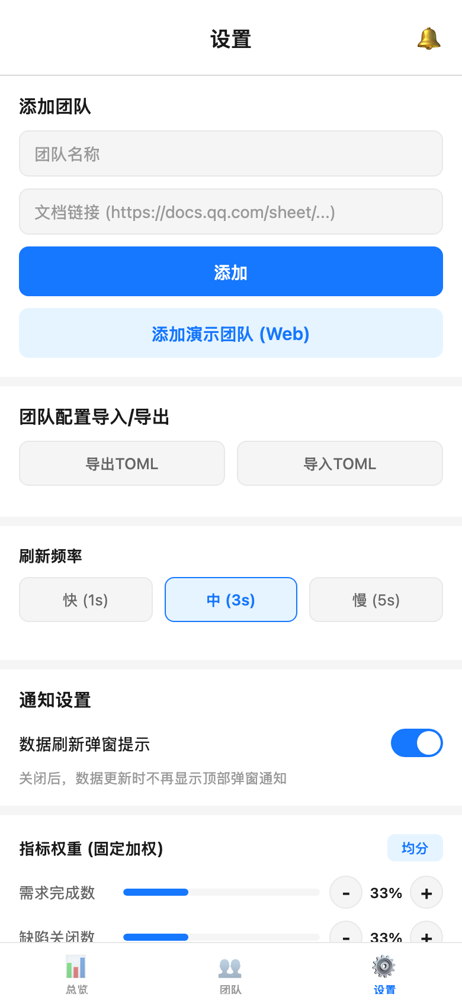

# QD Projects Manager

<p align="center">
  
</p>

<p align="center">
  <strong>Track multiple teams. Compare progress at a glance. Get notified when things change.</strong>
</p>

<p align="center">
  
  
  
  
  
</p>

<p align="center">
  <a href="#what-you-see">Screenshots</a> · <a href="#getting-started">Quick Start</a> · <a href="#how-indicators-are-managed">How It Works</a> · <a href="README.zh-CN.md">中文文档</a>
</p>

---

You oversee several project teams. Each files their KPIs into a separate Tencent Docs spreadsheet — patents filed, partners signed, milestones hit. Comparing them means opening every sheet, cross-referencing cells, and hoping you catch the moment someone quietly adds a new row or drops one.

QD Projects Manager does that for you. Paste a spreadsheet link, give the team a name, and the app pulls the numbers, ranks everyone, and watches for changes in the background. When something moves, you hear about it.

## What you see

<p align="center">
  
  &nbsp;
  
  &nbsp;
  
</p>

<p align="center">
  <sub>Overview — team rankings &amp; leaderboards &nbsp;|&nbsp; Teams — per-team detail cards &nbsp;|&nbsp; Settings — weights, refresh, config</sub>
</p>

**Overview** shows all teams ranked by overall progress. Each card has a stacked bar — one color per indicator — so you can read both the total and the breakdown without tapping in. Below the rankings, per-indicator leaderboards let you compare a single KPI across teams, toggling between raw numbers and percentages.

**Teams** gives every team its own detail card: each indicator with a progress bar, current value, and target. You can sort by any indicator or overall score, and filter down to completed, incomplete, or a custom condition like "patents > 50".

**Settings** is where you add or remove teams, adjust how often data refreshes, tune indicator weights (if patents matter twice as much as partnerships, say so here), and import or export your team list.

---

## How indicators are managed

The app tracks the *intersection* of all teams' indicators — only KPIs that every team reports show up in rankings.

Each refresh, the app snapshots every team's indicator list and diffs it against the previous one:

| Scenario | What happens | UI |
|:---------|:-------------|:---|
| A team's numbers changed | Quiet bubble notification | *"Team A updated Patents"* |
| All teams add a new indicator | Bubble notification | *"Patents has been added"* |
| Some teams add, others don't | Modal alert (must acknowledge) | Share button drafts an alignment message |
| Some teams delete an indicator | Modal alert + red **Stop Tracking** button | Removes indicator from rankings immediately |
| All teams delete an indicator | Tracking stops automatically | Modal to acknowledge or share |

The "Share" button drafts a message — *"I noticed Team A added indicator Patents — should we align?"* — and hands it to your system share sheet. An indicator added by only some teams is *not* tracked until every team has it.

Everything is logged in the **Message Center** (bell icon, top-right), with an unread badge and a "new messages above this line" divider.

---

## Spreadsheet format

Your Tencent Docs spreadsheet should follow this structure:

| Indicator | Target | 2026-01 | 2026-02 | 2026-03 | ... |
|-----------|--------|---------|---------|---------|-----|
| Patents   | 200    | 5       | 10      | 20      | ... |
| Partners  | 100    | 30      | 35      | 70      | ... |

- **Column 1** — indicator name (must match across teams for cross-team comparison)
- **Column 2** — target value
- **Remaining** — actual values over time

The app takes the **maximum value** across all date columns and computes progress as `min(max, target) / target`. Tracked indicators are the intersection of all teams' indicator names.

---

## Getting started

### Prerequisites

- Node.js 18+
- npm 9+

### Install

```bash
git clone https://github.com/your-org/qd-projects-manager.git
cd qd-projects-manager
npm install
```

### Run

| Command | What it does |
|:--------|:-------------|
| `npm start` | Start Expo dev server — scan QR with Expo Go |
| `npm run web:dev` | Start web dev server + CORS proxy in one command |
| `npm run build:apk` | Build Android APK via EAS cloud (no Android Studio) |

**First time building APK?** Run `npx eas login` once before `npm run build:apk`.

---

## Changelog

### v0.1.0 (2026-03-12)

Initial release.

- Multi-team KPI tracking from Tencent Docs spreadsheets
- Overview with team rankings and stacked progress bars
- Per-indicator leaderboards with raw/percentage toggle
- Team detail cards with sort and filter
- Automatic indicator management — detects adds, deletes, and data changes across teams
- Modal alerts for indicator inconsistencies with share-to-align workflow
- Message Center with unread badges and event log
- Configurable indicator weights and refresh rate
- TOML-based team config import/export
- Web CORS proxy for local development
- EAS cloud build for Android APK

---

## Contributing

1. Fork this repository
2. Create a feature branch
3. Submit a pull request

## License

[MIT](LICENSE)
